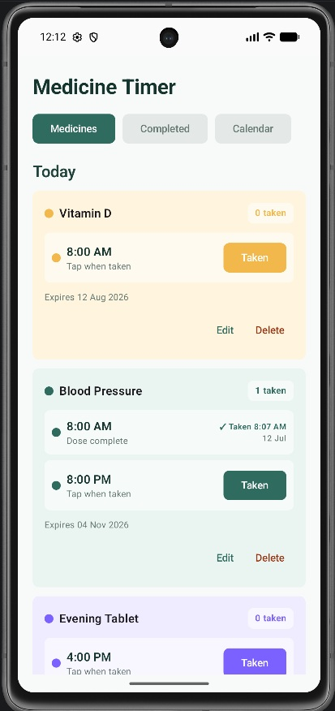
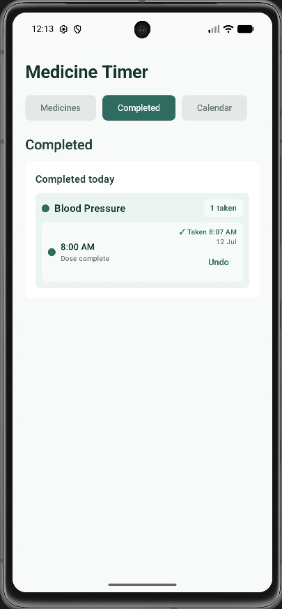
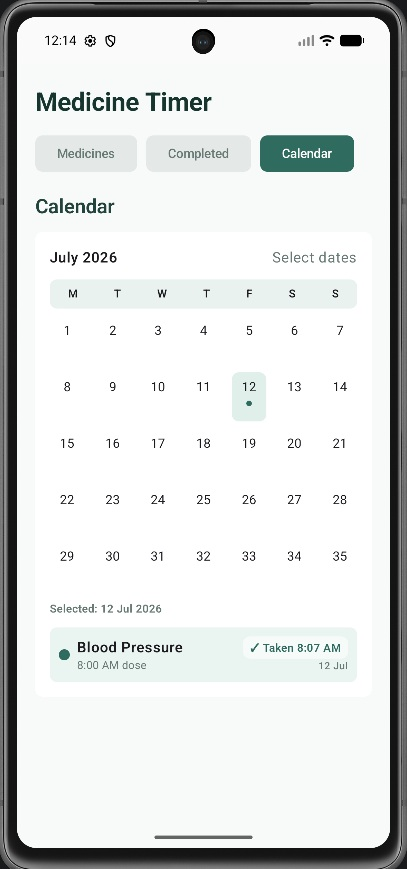

# Medicine Timer

Medicine Timer is a native Android APK for tracking daily medicines, reminder times, tablet expiry dates, and confirmed taken doses.

The app is built with Kotlin, Jetpack Compose, Android Gradle Plugin, and the checked-in Gradle wrapper.

## Screenshots

### Medicines

Example: daily medicines with individual reminder times, taken counts, expiry dates, and edit/delete actions.



### Completed

Example: completed doses grouped by medicine, including the taken time and undo action.



### Calendar

Example: a selected calendar date showing the completed dose history for that day.



## Features

- Three main tabs: `Medicines`, `Completed`, and `Calendar`.
- Per-medicine color identity across the medicine list, completed history, and calendar.
- Multiple reminder times per medicine.
- A separate `Taken` action for each scheduled time.
- Undo support for mistaken taken confirmations.
- Completed medicines move below active medicines under `Completed for the day`.
- Completed tab groups taken doses by medicine.
- Calendar view shows confirmed taken history as read-only records.
- Add, edit, and delete medicine flows.
- Delete confirmation for destructive medicine removal.
- Expiry date selection with a calendar picker.
- Branded launcher icon and startup screen.

## APK

Build the debug APK with:

```powershell
.\gradlew.bat :app:assembleDebug
```

The generated APK name is versioned, for example:

```text
MedicineTimer-v0.1.0-debug.apk
```

A local release copy can be placed under:

```text
release/
```

APK and AAB files are ignored by git.

## Open In Android Studio

1. Open Android Studio.
2. Select `File > Open`.
3. Choose this repository folder.
4. Let Gradle sync complete.

`local.properties` is intentionally ignored because it contains the local Android SDK path.

## Repository Hygiene

This repository is prepared for public GitHub use. Do not commit:

- Android Studio local metadata
- `local.properties`
- signing keys or keystore files
- API keys, service account files, or private config
- generated APK/AAB outputs
- private exported medicine, reminder, expiry, or adherence data

## License

Medicine Timer is open source under the [MIT License](LICENSE).

## Roadmap

Local persistence is in place. Real notification scheduling, permission handling, and test coverage are planned as the next engineering layer.
